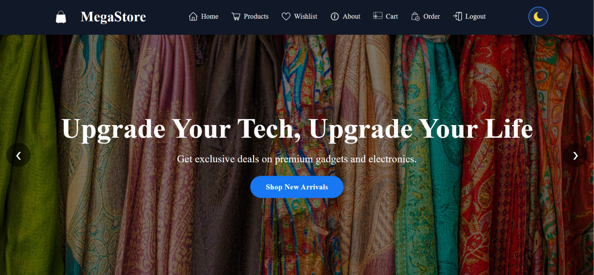
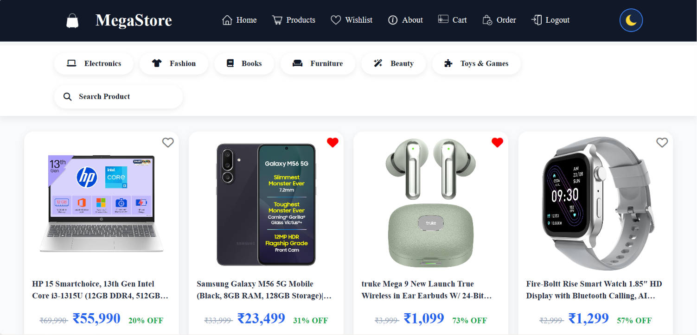
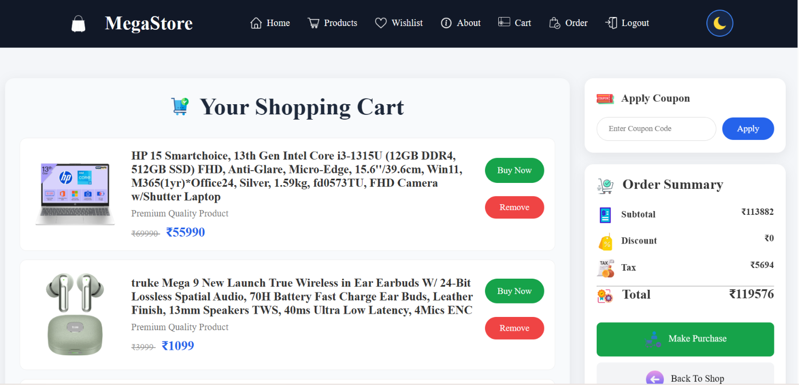

# 🛒 MegaStore - E-Commerce Website
<h2 align="center">📸 Website Preview</h2>

A modern and responsive <b>E-Commerce Website</b> built using
<b>HTML, CSS and JavaScript</b>.
Users can browse products, view details, manage cart and wishlist,
place orders, and enjoy a smooth shopping experience.

---

## 🌐 Live Demo

🔗 [e-commerce-group-project.vercel.app](https://e-commerce-group-project.vercel.app/)

---

## 📸 ScreenShot

### 🏠 Home Page

---

### 🛍️ Products Page

---

### 🛒 Cart Page

---

## ✨ Features

 ##### - User Registration & Login System  
  ##### - Browse Products by Category  
  ##### - Product Search Functionality  
  ##### - Product Details Page  
  ##### - Add Products to Wishlist  
  ##### - Add to Cart Functionality  
  ##### - Checkout & Order Placement  
  ##### - Order History Management  
 ##### - Dark / Light Theme Toggle  
  ##### - Fully Responsive Design  

---

## 🛠️ Tech Stack

- HTML5
- CSS3
- JavaScript
- LocalStorage API

---

## 🚀 Getting Started
  Open **index.html** in your browser.

---
## 🤝 Contributors

---

## ⭐ Support

If you like this project, give it a ⭐ on GitHub.
